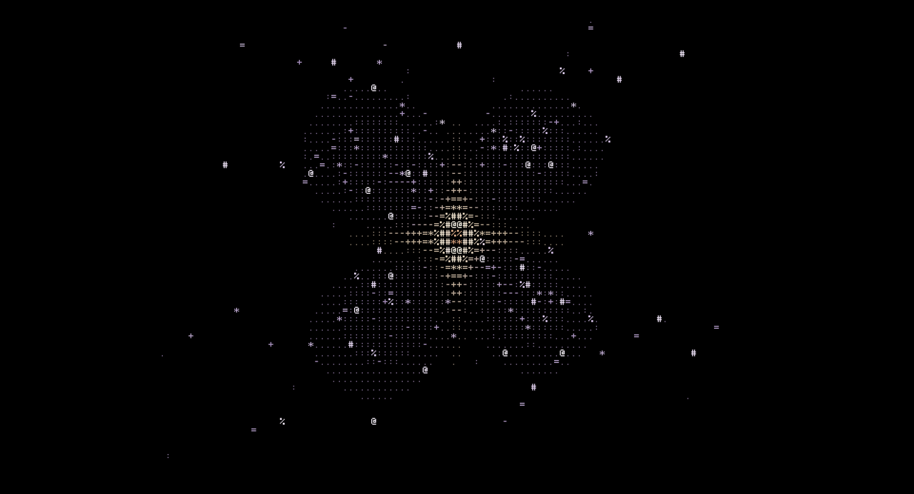

# Subatomic Wallpaper

A live ASCII-art wallpaper of atoms and protons for GNOME, rendered on the GPU.

An electron has no path, only a probability cloud. The wallpaper measures where the electron is 30 times a second. Each measurement flashes up as a bright character and fades, so the shape of the orbital builds up out of the shots, like a long exposure.



## Scenes

- **Hydrogen atom**: one proton, drawn as a star, and one electron.
  - The orbitals are the exact hydrogen wave functions 1s, 2p, 3d and 4f, as real orbitals (lobes) or as orbitals with angular momentum (rings).
  - Each shot lands white-hot and cools to the orbital's color as it fades.
  - With Events on, the atom never sits still. It plays a random series of episodes:
    - **Ladder**: it absorbs a Lyman-alpha photon (1s → 2p), an H-alpha photon (2p → 3d) and a Paschen-alpha photon (3d → 4f), up to a random level, then falls back step by step and emits them again;
    - **Ionization**: an ultraviolet photon tears the electron away. The cloud balloons and vanishes, and the bare proton flickers. Then an electron falls back in, lands high up and cascades down, firing its photons one after another;
    - **Laser**: a laser beam makes the cloud flip between 1s and 2p over and over (Rabi flopping). Now and then the atom drops back on its own and sends a photon off to the side;
    - **Positron**: a positron spirals in and annihilates with the electron in a flash. Two gamma rays fly off back to back, then an electron is captured again.
  - During a jump the electron is in a superposition of both orbitals. With lobes, the cloud sloshes back and forth along the transition's dipole axis. With rings, a bright lump of the cloud circles the nucleus.
  - With lobes, photons leave mostly at right angles to the dipole axis and never along it, as dipole radiation does. With rings, photons leave in every direction, most strongly along the axis, where the light is circularly polarized. A shockwave shell shows the pattern: dark along the axis for lobes, all around for rings.
  - An electron knocked out by a photon leaves sideways, not along the photon's path.
  - H-alpha is drawn in its true red. Lyman-alpha (ultraviolet) and Paschen-alpha (infrared) are invisible to the eye and drawn in false violet and dark red.
- **Atom with a nucleus**: helium, carbon, oxygen or neon.
  - Orbitals are Slater-type orbitals with Slater's screening rules. The 2p electrons follow Hund's rule.
  - The nucleus holds the real number of protons (orange) and neutrons (blue). They are grouped into helium-4 clusters, as in the alpha-cluster model of carbon-12, oxygen-16 and neon-20: a triangle, a tetrahedron and a bipyramid. The nucleus tumbles, and pairs of nucleons flash now and then, a nod to the pions they trade.
  - With Events on, one event follows another every 20 seconds or so:
    - **X-ray**: an X-ray knocks an electron out of the 1s shell, and the camera dives into the nucleus and back;
      - mostly an Auger electron leaves as a 2p electron drops into the hole. Sometimes a second electron is shaken off at once;
      - sometimes the 2p electron emits a K-alpha X-ray instead. In light atoms this is the rare branch; over 98 % of the time an Auger electron leaves;
      - helium has no 2p electron, so it only loses its electron;
    - **Positron**: a positron spirals in and annihilates with an outer electron, sending two gamma rays off back to back;
    - the ion then captures its missing electrons one by one, each with a photon.
  - The cloud shrinks as the atom loses electrons, because the rest feel more of the nucleus, and swells back as it recaptures them. The sizes follow Slater's rules at every step.
- **Quarks in a nucleon**: a proton (uud) or a neutron (udd).
  - The three quarks carry red, green and blue color charge.
  - A Y-shaped gluon string holds them together. Gluons carry a color and an anticolor from quark to quark, so the colors keep swapping. Counting the gluon in flight, the total is always white.
  - Quark-antiquark pairs flicker in and out of the gluon sea.
  - With Events on, an electron hits a quark, as in the experiments that discovered quarks. The quark recoils, the string stretches and snaps, and a new quark-antiquark pair forms. A meson flies away and the nucleon is whole again.
    - This is a simplified single string break. In real deep inelastic scattering the nucleon usually shatters into jets of many hadrons.

## Not to scale

- A real nucleus is about 100,000 times smaller than its atom. The nucleus is drawn far larger so you can see it.
- Everything is slowed down to seconds: electron cloud oscillations from femtoseconds, excited state lifetimes from nanoseconds, and quark and gluon motion from about 10⁻²⁴ seconds.
- Each shot measures a fresh copy of the atom. A real measurement would disturb the electron.
- Between jumps a little superposition is kept so the cloud keeps moving. A real atom at rest in one level is still.
- The camera breathes in and out and drifts a little, and it follows the atom as the orbital grows.

## Settings

- Shots per second, atoms per shot, afterglow and a faint probability cloud behind the shots.
- Moving the cursor turns the camera. The camera eases after it.
- Zoom by pinching with two fingers on a touchpad. Super+Ctrl+scroll zooms from anywhere, and plain scrolling on an empty desktop also zooms.
- The atom turns slowly. Speed, rotation, camera height, tilt, character size and brightness can be changed.
- The lock screen shows a still frame.
- Rendering pauses behind maximized and fullscreen windows.

## Install

```
make install
```

Then log out and back in, and enable it in Extensions.
